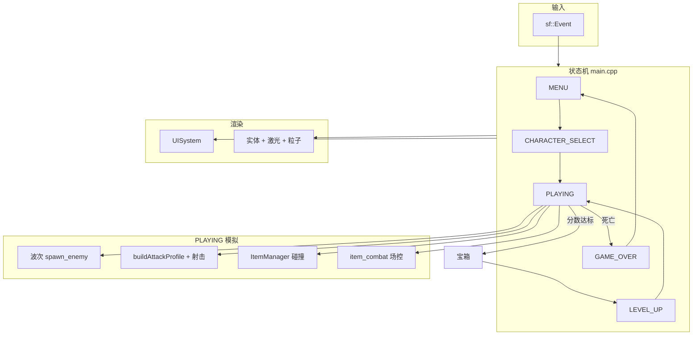

# 《以撒版飞机大战》开发手册

> 技术栈：C++17 · SFML 2.6.2 · VS2022 (x64)  
> 文档版本：v4.1（与当前源码对齐）  
> 更新日期：2026-06-04

本文档面向**希望系统学习本项目**的开发者，说明核心架构、程序流程与关键函数。更细的道具融合规则见 [ITEM_SYSTEM.md](ITEM_SYSTEM.md)；旧版单文件说明见 [PROJECT_FRAMEWORK.md](PROJECT_FRAMEWORK.md)（已过时，仅作历史参考）。

---

## 1. 项目是什么

纵版射击 + 《以撒的结合》式成长：

- **属性**：HP、伤害、射速、弹速、射程、移速、额外弹道、宝宝数量等（`PlayerStats`）
- **道具**：注册表 10 种被动，升级三选一 + 地图低概率掉落
- **武器融合**：硫磺火 / 20/20 / 魔术弯勺等组合改变攻击形态（`buildAttackProfile` + `BrimstoneLaser` + `BulletFactory`）
- **场控战斗**：背叛、冰冻、击退、被动投射物（`item_system`）
- **波次**：每层 1 波敌人，清完休息 3.5s；`player_level`（1~6）同时驱动难度与房间背景

窗口：**800×900**，逻辑帧 **`FRAME_TIME = 1/60`**（`player_stats.h`）。

---

## 2. 源码地图（按职责分层）

```
IssacPlaneFight/
├── main.cpp                 ★ 状态机、主循环、波次、敌人生成/弹幕、全局 vector
├── player_stats.h           ★ 实体 struct、Player 类、屏幕常量
├── player_stats_extension.h   道具扩展字段（神性、苹果、镜像分身等）
├── player_item.cpp            Player::applyItem
│
├── passive_item.h / passive_items.cpp   Item 多态 + ItemFactory
├── item_registry.h / item_registry.cpp  UI 元数据（名称、描述、图标路径）
│
├── attack_profile.h / attack_resolver.cpp   每帧攻击形态 buildAttackProfile
├── weapon_profile.h / weapon_synergy_resolver.*  （策略表，部分逻辑已并入 attack_resolver）
├── bullet_factory.h / bullet_factory.cpp        普通泪弹发射与更新
├── brimstone_laser.h / brimstone_laser.cpp      硫磺火蓄力激光
├── parasite_bullet.h / parasite_bullet.cpp      寄生虫分裂
├── split_laser.h / split_laser.cpp              硫磺火+寄生虫短激光
├── haemolacria.h / haemolacria.cpp              泪血症血球
├── baby_system.h / baby_system.cpp              环绕宝宝射击
├── tear_profile.h / tear_profile.cpp            泪弹贴图 ID
│
├── item_system.h / item_system.cpp    被动投射物、EnemyDamageable、碰撞结算
├── module3_tears.h / module3_tears.cpp  模块三泪弹（苹果/背叛/神性/玻璃）
├── damageable.h                       IDamageable、阵营、Hitbox
│
├── ui_system.h / ui_system.cpp        菜单、HUD、房间背景、宝箱、三选一 UI
├── game_character.h / character_roster.* / isaac_character.*  选角
├── level_up_panel.h / level_up_panel.cpp  （遗留；主流程已迁到 UISystem）
│
├── item_test_loader.*               JSON 调试用例加载
├── gfx/                             贴图资源
├── test_items.json / test_combat_status.json
└── PlaneWar.sln / PlaneWar.vcxproj
```

**设计原则**：`main.cpp` 负责**编排**；数值与规则尽量下沉到各 `*system*` / `*factory*` / `item_system`。

---

## 3. 核心架构图

```
                    ┌─────────────────────────────────────┐
                    │         sf::RenderWindow            │
                    └──────────────────┬──────────────────┘
                                       │
         ┌─────────────────────────────┼─────────────────────────────┐
         ▼                             ▼                             ▼
   ┌───────────┐               ┌───────────────┐              ┌────────────┐
   │ 事件输入   │               │  GameState    │              │  UISystem  │
   │ 键鼠/关闭  │──────────────►│   状态机      │─────────────►│ 纯渲染+UI │
   └───────────┘               └───────┬───────┘              │ 状态      │
                                       │                      └────────────┘
                                       ▼
                              ┌────────────────┐
                              │     Player     │
                              │ stats + items  │
                              └────────┬───────┘
                                       │
     ┌─────────────┬──────────────┬─────┴─────┬──────────────┬─────────────┐
     ▼             ▼              ▼           ▼              ▼             ▼
 buildAttack   BulletFactory  Brimstone   ItemManager   item_combat   module3::
 Profile       + bullets[]    Laser       passives[]    场控/背叛      特殊泪弹
     │             │              │           │              │             │
     └─────────────┴──────────────┴───────────┴──────────────┴─────────────┘
                                       │
                              std::vector 全局容器
                         enemies / enemy_bullets / particles / ...
```

| 层 | 模块 | 读写游戏状态 |
|----|------|----------------|
| 编排层 | `main.cpp` | 读写（唯一应集中改状态的地方） |
| 数据层 | `player_stats.h`、`Player` | 玩家属性、实体 struct |
| 规则层 | `item_system`、`module3`、`bullet_factory`… | 通过参数引用修改实体 |
| 展示层 | `ui_system` | **只读** `Player` 等用于绘制；宝箱/选道具 UI 状态自持 |

---

## 4. 游戏状态机

```cpp
enum class GameState {
    MENU,              // 等待界面（waiting_screen）
    CHARACTER_SELECT,  // 选角 → reset_game → PLAYING
    PLAYING,
    LEVEL_UP,          // 三选一（游戏画面仍渲染，逻辑暂停移动/波次）
    GAME_OVER
};
```

### 4.1 状态转换

```
MENU ──Enter──► CHARACTER_SELECT ──点选角色──► PLAYING
                                                    │
                    game_score ≥ next_level_threshold
                                                    │
                                                    ▼
                                          spawn_item_chest（仍 PLAYING）
                                                    │
                                    宝箱落地+开箱动画结束
                                                    │
                                                    ▼
                                              LEVEL_UP
                                                    │
                                    选中道具 applyItem + player_level++
                                                    │
                                                    ▼
                                              PLAYING

PLAYING ── HP≤0 ──► GAME_OVER ──Enter──► MENU
```

**升级节奏（与旧文档不同）**：

1. 分数达标时 **不立刻** `LEVEL_UP`，而是 `level_up_chest_armed = true` 并 `ui_system.spawn_item_chest()`。
2. 玩家在 `PLAYING` 中继续战斗，每帧 `update_item_chest`；返回 `ReadyForItemPick` 后 `begin_item_pick` + `game_state = LEVEL_UP`。
3. `LEVEL_UP` 中 `update_item_pick` 返回 registry 索引 → `ItemFactory::create` → `player.applyItem`。

相关变量（`main.cpp`）：`pending_level_up_options`、`level_up_chest_armed`、`roll_level_up_item_options()`。

---

## 5. 主循环程序流程

### 5.1 启动（`main()`）

```
创建 RenderWindow(800×900, 60FPS)
UISystem::initialize()
Player player
game_state = MENU
while (window.isOpen()) { ... }
```

### 5.2 每帧骨架

```
1. pollEvent
   - Escape 关闭
   - Enter：MENU→选角；GAME_OVER→MENU
   - 调试键（PLAYING）：Num1~0、F1~F11、B/I 冰弹测试等

2. switch (game_state)  // 逻辑
   MENU / GAME_OVER：无模拟
   CHARACTER_SELECT：ui_system.update_character_select
   PLAYING：见 §6
   LEVEL_UP：ui_system.update_item_pick → applyItem

3. switch (game_state)  // 渲染
   MENU：draw_waiting_screen
   CHARACTER_SELECT：draw_character_select
   PLAYING / LEVEL_UP：世界层（房间、实体、HUD）+ LEVEL_UP 时 draw_item_pick
   GAME_OVER：draw_game_over

4. 叠加层：debug_toast、pickup_toast、status_icons、module2 全屏闪白
5. window.display()
```

---

## 6. PLAYING 逻辑顺序（学习重点）

下列顺序与 `main.cpp` 中 `case GameState::PLAYING` **执行顺序一致**：

| 步骤 | 内容 | 关键 API |
|------|------|----------|
| 1 | 清理死亡敌人 | `item_combat::remove_dead_enemies` |
| 2 | 移速（道具 debuff 等） | `item_combat::apply_player_move_speed` |
| 3 | WASD 移动 + 边界 clamp | 直接改 `player.pos` |
| 4 | 升级宝箱（若 armed） | `ui_system.update_item_chest` → 可能切 `LEVEL_UP` |
| 5 | 宝宝轨道 | `BabySystem::updateOrbit` |
| 6 | 攻击形态 | `buildAttackProfile(player)` |
| 7 | 射击 | `BrimstoneLaser::updateChargeInput`（非泪血症） |
| | | `BulletFactory::tryFire` / `updateBullets` |
| 8 | 模块三泪弹逻辑 | `module3::update_player_bullets` |
| 9 | 敌人弹、场控 tick | 敌人弹位移；`item_combat::tick_enemies_combat` |
| 10 | 敌人移动/碰撞玩家 | 追踪 AI；`take_damage` → 可能 `GAME_OVER` |
| 11 | 被动投射物 | `g_item_manager.update`；`update_passive_spawns` |
| 12 | 碰撞结算 | `g_item_manager.resolve_projectile_hits` + 回调里加分/掉落 |
| 13 | 地图道具 / 红心 | `power_ups`、`health_drops` |
| 14 | 粒子 | `particles` |
| 15 | 玩家计时器 | `player.update_timers()` |
| 16 | 激光与分裂激光 | `BrimstoneLaser::updateLaser`；`SplitLaserSystem::update` |
| 17 | 波次刷怪 | `init_layer_waves` / `start_layer_wave` / `start_wave_pause` |
| 18 | 敌人射击（东方弹幕） | `enemy.shoot_timer` + 按 `EnemyType` 分支 |
| 19 | 弹幕互殴（背叛） | 敌方弹 vs 倒戈；倒戈弹 vs 敌方 |
| 20 | 玩家中弹 | `enemy_bullets` vs `player` |
| 21 | 触发升级宝箱 | `game_score >= next_level_threshold` |

**渲染顺序（PLAYING/LEVEL_UP）** 简述：房间背景 → 掉落物 → 泪弹/模块三 → 敌弹 → 敌人+血条+场控 overlay → `ItemManager` 被动 → 宝箱 → 硫磺火/分裂激光 → 粒子 → Isaac 精灵 → HUD →（LEVEL_UP）选道具面板。

---

## 7. 道具与武器系统

### 7.1 拾取管线

```
LevelUp 选中 / 地图 PowerUp 碰撞
    → ItemFactory::create(registry_index)
    → Player::applyItem(Item*)
         → collected_items.push_back(id)
         → item->applyTo(player)   // 改 stats / stats_ext / levels
    → 每帧 buildAttackProfile(player)   // 决定激光宽、并行道数、追踪
    → BulletFactory / BrimstoneLaser / BabySystem / module3 / item_combat
```

### 7.2 注册表道具（`item_registry.cpp`）

| 索引 | ID（`ItemIds`） | 名称 |
|------|-----------------|------|
| 0 | spoon_bender | 魔术弯勺 |
| 1 | brimstone | 硫磺火 |
| 2 | 20/20 | 20/20 |
| 3 | parasite | 寄生虫 |
| 4 | haemolacria | 泪血症 |
| 5 | spike_nail | 八寸钉 |
| 6 | betrayal | 背叛 |
| 7 | apple | 苹果刀片 |
| 8 | godhead | 神性 |
| 9 | glass_shard | 玻璃碎片 |

### 7.3 攻击形态（`buildAttackProfile`）

优先级逻辑在 `attack_resolver.cpp`：

1. **硫磺火**：`brimstone_level` → 激光半宽（双层 20，单层 10）
2. **额外弹道**：`extra_bullets` → `parallel_lanes`
3. **追踪**：`tracking_level`；神性强制追踪 + 金色弹
4. **宝宝**：`baby_count` → `BabySystem`

泪血症时 **跳过** 硫磺火蓄力（`!player.stats.has_haemolacria` 守卫）。

更完整的融合表见 [ITEM_SYSTEM.md](ITEM_SYSTEM.md) 与 `weapon_synergy_resolver.cpp`。

### 7.4 场控与被动投射物（`item_system`）

- **`EnemyDamageable`**：包装 `Enemy`，实现 `IDamageable`（伤害、冰冻、背叛、击退）
- **`ItemManager`**：`spawn_passive` + `resolve_projectile_hits`（玩家 `bullets` + 被动 vs 敌人）
- **`item_combat` 命名空间**：`update_passive_spawns`、`spawn_spike_nail_burst`、`spawn_ice_cube_baby` 等，供 `main` 与调试键调用

`PlayerStatsItemFields` / `g_player_item_fields`：每帧同步道具标志，驱动移速倍率等。

---

## 8. 波次与难度

| 函数 | 作用 |
|------|------|
| `get_layer_probs(layer)` | 1~6 层敌类型概率 |
| `determine_enemy_type(layer)` | 随机类型 |
| `calc_enemies_for_layer(layer)` | `8 + layer×5` 敌人数 |
| `init_layer_waves()` | 新层 2.5s 准备 |
| `start_layer_wave()` | 开始刷怪 |
| `start_wave_pause()` | 清场后休息 3.5s |
| `spawn_enemy()` | 按层数+类型生成 HP/颜色/速度 |

**升级阈值**：初始 800；升级后 `+= 500 + player_level² × 80`。  
**道具地图掉落**：分数 ≥ `next_drop_score`、冷却 20s、8% 概率（`spawn_item_pickup`）。

---

## 9. 全局容器（`main.cpp`）

```cpp
std::vector<Bullet> bullets;           // 玩家泪弹
std::vector<Bullet> enemy_bullets;
std::vector<Enemy> enemies;
std::vector<PowerUp> power_ups;
std::vector<HealthDrop> health_drops;
std::vector<Particle> particles;
std::vector<SplitLaser> split_lasers;

ItemManager g_item_manager;            // 被动投射物
PlayerStatsItemFields g_player_item_fields;
item_combat::PassiveSpawnTimers g_passive_timers;
```

删除模式：下标遍历，`erase` 时 **不递增** `i`（项目内统一习惯）。

---

## 10. 关键函数速查

### 10.1 `main.cpp`

| 函数 | 作用 |
|------|------|
| `random_float` / `random_int` | 全局 `mt19937` 随机 |
| `check_collision` | AABB 矩形碰撞 |
| `spawn_particles` | 爆炸粒子 |
| `find_nearest_enemy` | 追踪弹目标（工厂内也会用） |
| `roll_level_up_item_options` | 洗牌抽 3 个 registry 索引 |
| `reset_game` | 清空容器、重置分数/波次/激光/ItemManager |
| `cleanup_upgrade_flow` | 清空升级宝箱与 pending 选项 |

### 10.2 `Player`（`player_stats.h` + `player_item.cpp`）

| 方法 | 作用 |
|------|------|
| `applyItem(Item*)` | 收集 id + 调用 `applyTo` + `clampStats` |
| `hasItem(id)` | 是否已拥有 |
| `get_damage()` | `ceil(stats.damage)` |
| `take_damage()` | 护盾 → 隐形 → HP-1 |
| `update_timers()` | 护盾/隐形倒计时 |

### 10.3 战斗与发射

| 类型 | 关键入口 |
|------|----------|
| 攻击形态 | `buildAttackProfile` |
| 普通弹 | `BulletFactory::tryFire`, `updateBullets` |
| 激光 | `BrimstoneLaser::updateChargeInput`, `updateLaser`, `render` |
| 寄生虫/分裂 | `enqueue_parasite_*`, `SplitLaserSystem::*` |
| 泪血症 | `HaemolacriaSystem::*` |
| 模块三 | `module3::update_player_bullets`, `render_player_bullet` |
| 碰撞 | `ItemManager::resolve_projectile_hits` |

### 10.4 `UISystem`（主程接入契约）

| 方法 | 时机 |
|------|------|
| `initialize` / `reset_run_state` | 启动 / 新局 |
| `notify_enter_character_select_screen` | MENU→选角防连按 |
| `update_character_select` | 返回 `CharacterId` 或 -1 |
| `spawn_item_chest` | 分数达标后 |
| `update_item_chest` | 每帧 PLAYING；`ReadyForItemPick` → 进 LEVEL_UP |
| `begin_item_pick` / `update_item_pick` / `draw_item_pick` | 三选一 |
| `draw_room_background` / `draw_isaac_player` / `draw_hud` | 战斗中 |

详见 `ui_system.h` 顶部注释。

---

## 11. 建议阅读顺序

```
第 1 天 — 骨架
  player_stats.h          → Bullet / Enemy / Player
  main.cpp 第 38~56 行    → GameState
  main.cpp 第 732~930 行  → main 初始化与状态分支
  ui_system.h 注释        → UI 与主程边界

第 2 天 — 成长与射击
  passive_item.h + passive_items.cpp
  player_item.cpp
  item_registry.cpp
  attack_resolver.cpp + bullet_factory.cpp
  brimstone_laser.cpp（前半：蓄力状态机）

第 3 天 — 战斗扩展
  damageable.h
  item_system.h（EnemyDamageable、ItemManager 声明）
  item_system.cpp（update / resolve_projectile_hits）
  module3_tears.cpp（选读一种道具分支）

第 4 天 — 内容与打磨
  main.cpp 波次 § spawn_enemy § 敌人射击
  ui_system.cpp（宝箱、三选一、HUD）
  item_test_loader + test_items.json（调试）
```

---

## 12. 调试与测试

| 输入 | 作用（需 `PLAYING`） |
|------|----------------------|
| Num1~0, F1~F11 | 加载 `test_items.json` 等用例 |
| Shift+Num1~4 | `module3::enable_single_item_test` |
| B / I | 冰弹宝宝快速测试 |
| F5 / F6 / F7 | 冰冻 / 背叛 / 击退单个敌人 |

控制台：`debug.log`（exe 同目录）、Windows 下调试控制台。

房间背景验收：`ui_system` 内 F1~F5 / PageUp/Down（见 `ui_system.h` 注释）。

---

## 13. 编译与运行

```powershell
# 需 SFML 2.6.2，路径见 PlaneWar.vcxproj（SFML_DIR 或默认 ../SFML-2.6.2）
MSBuild PlaneWar.sln /p:Configuration=Debug /p:Platform=x64
.\bin\Debug\PlaneWar.exe
```

| 按键 | 功能 |
|------|------|
| Enter | 开始 / 结束回菜单 |
| WASD / 方向键 | 移动 |
| Space / J | 射击 |
| Esc | 退出 |

---

## 14. 架构演进说明

| 版本特征 | 说明 |
|----------|------|
| v3.x | 逻辑集中在 `main.cpp` + `player_stats.h` 内联道具 |
| v4.0+ | 道具多态、`ItemManager`、模块化武器与 UI |
| 当前 | `main.cpp` 仍 ~1900 行，但是**编排者**；新功能应优先加在对应模块 |

**UI 隔离开发**（`.cursorrules`）：独立改 UI 时只动 `ui_system.*`，通过引用只读 `Player`；改玩法需主程改 `main.cpp` 或其它规则模块。

---

## 15. 总览流程图（Mermaid）



---

*若你发现文档与源码不一致，以 `main.cpp` 与 `PlaneWar.vcxproj` 的编译列表为准，并优先更新本节与 [ITEM_SYSTEM.md](ITEM_SYSTEM.md)。*
